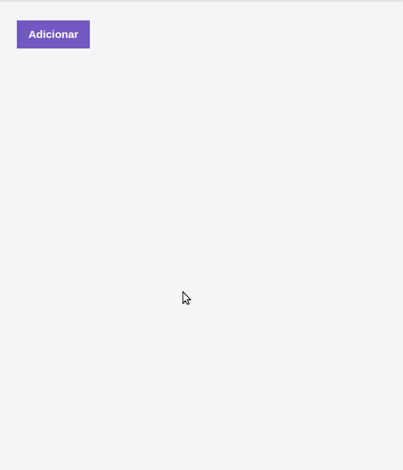

# Desafio 03 - Conceitos de React Js

> Projeto Aplicado pela rocketseat durante o bootcamp Gostack.

## Sobre o Desafio

A aplicação que irá armazenar repositórios do portfólio, utilizando o backend do desafio anterior.

  :rocket: :point_right: [Acesse o Desafio anterior](https://github.com/tnazevedo/Desafio02-Nodejs) :point_left:

## :exclamation: Dependências do projeto

- :thumbsup: axios.
- :thumbsup: react-dom.
- :thumbsup: react.
- :thumbsup: react-scripts.


## :ok_hand: Exemplo de uso




## Configuração para Desenvolvimento

Para o ambiente de Desenvolvimento instale as dependencias abaixo utlizando,gerenciador de pacote não esqueça de iniciar o servidor do backend.

### Api configurada para consumir o backend em localhost
```js
"http://localhost:3333",

```

```sh
make install
npm test ou yarn test
```

## :v: :v: Meta

Talita Azevedo – [Github - tnazevedo](https://github.com/tnazevedo/) – talita.azevedo360@gmail.com

## :star: :star: :star: Contributing

1. Faça o _fork_ do projeto (<https://github.com/tnazevedo/Desafio02-Nodejs/fork>)
2. Crie uma _branch_ para sua modificação (`git checkout -b feature/fooBar`)
3. Faça o _commit_ (`git commit -am 'Add some fooBar'`)
4. _Push_ (`git push origin feature/fooBar`)
5. Crie um novo _Pull Request_
